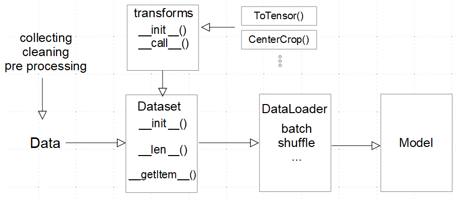

# Brain Tumor Segmentation
## Descripción
- En este repositorio, almaceno un proyecto de segmentación binaria de tumores cerebrales, implementando una U-Net *from scratch*.

- *Dataset:* El dataset utilizado fue "Brain Tumor Image DataSet", disponible en Kaggle. 

====

## Código
### - Load Data:
- **[custom_dataset.py](./custom_dataset):**
  - Archivo que contiene el código para la creación del custom dataset.
  - **Objetivo:** Para evitar cargar todas las imágenes y máscaras en memoria, se creó el custom dataset con la finalidad de obtener los datos solo en el momento de su utilización --> Lazy load.
  - **Nota:** Incluye el preprocesamiento de las imágenes y máscaras (se puede aplicar Data Augmentation)
  
- **[read_img_json.py](./read_img_json.py):**
  - Lee el archivo json (donde se encuentran las anotaciones) y retorna el nombre de la imagen más el *bounding box* (contorno) de la máscara de segmentación.
  - **Objetivo:** Función útil para permitir el *lazy load* en el custom dataset.

  

### - Modelos:
- **[modelo1.py](./modelo1.py):**
  - UNet implementada desde cero, con pocos parámetros (menor a 1 millón)
  - Modelo pequeño de prueba para verificar el *load* correcto de los datos.
  - **Objetivo:** Analizar el performance frente al modelo 2.
    
- **[modelo2.py](./modelo2.py):**
  - UNet implementada desde cero, con más parámetros (mayor a 4 millones)
  - Adicional, contiene la operación *crop* para permitir la concatenación de los feature maps generados por el encoder (mayor tamaño) con los creados por el decoder (menor tamaño). Y así, permitir las *concatenation skip connections*.
 

  

### - Training:
- **[training.py](./training.py):**
  - Archivo que contiene el código para el entrenamiento del modelo. 

### - Evaluación:
- **[metrics.py](./metrics.py):**
  - Contienen las **loss functions** y métricas a utilizar para entrenar y evaluar el **performance** del modelo.
  - **Objetivo:** Facilitar el uso directo de loss functions y métricas durante el entrenamiento y evaluación.

====

## Entrenamiento
- El entrenamiento se realizó en Kaggle por el uso de GPU.
- ¡Aquí puedes encontrar el Notebook! [TrainingNotebook](./)
- Resultados
  - Train Loss
    

      
    

  - Validation Loss
    

      
    

